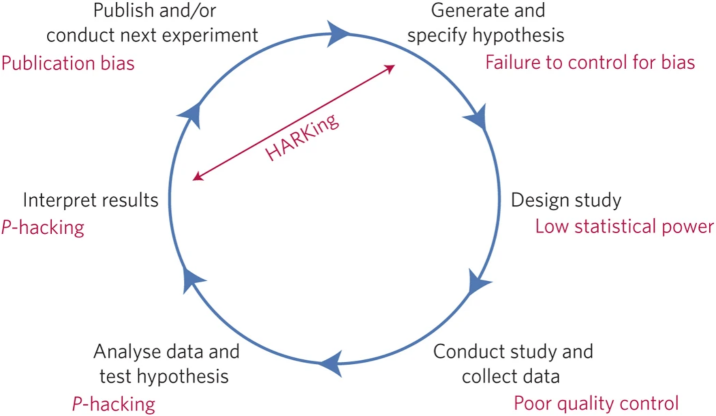

# journal_club_20210916

Journal Club 2021-09-16 presented by Richel Bilderbeek.

## Presentation

### Why this article?

When searching on Google Scholar for 'GWAS + "Open Science"', it is
the most relevant hit from 2021 and in general.

### Authors


### Summary

**GWAS declines in Open Science**.

With the HGP, GWAS was Open Science, as data, code/analyses and results/publications were shared.

GWAS then became mainstream.

Now GWAS is moved to Supplementary Materials, which are reviewed less, and also data, code/analyses and results/publications were shared less, partially because of the use of company data.

GWAS should increase openness and reproducibility to maintain scientific credibility.

### Discussion points

 * How would you rate the quality of the article?
 * To which extent do you agree with the article?
 * Where do you disagree with the article?

## Picture used as a spacer



> From [Munafo et al., 'A manifesto for reproducible science' in Nature human behaviour](https://www.nature.com/articles/s41562-016-0021),

### Another opinion

From [Joni Coleman](https://twitter.com/Joni_Coleman/status/1393192476773654535):

```
(IMO) a valuable, shin-kicking perspective from @callie_h_burt
 and @MarcusMunafo
 – GWAS needs to be transparent and justified in reporting its methods and the reasoning behind them.

#PLOSBiology: Has GWAS lost its status as a paragon of open science?
```


### My criticism

#### Many unreferenced claims

> Genome-wide association studies (GWAS) continued these open science trends [REFERENCE]. 
> The GWAS era arose following the widespread recognition of low statistical power [REFERENCE]
> and questionable methodological practices in candidate gene association studies [REFERENCE], 
> which were plagued by low reproducibility [REFERENCE].

#### No definition of Open Science

Which definition of Open Science is used?
It appears to be:

 * 'the sharing of materials, results, and data'
 * 'GWAS transparency'
 * Not 'partial results, no code, and no data'

As Munafo wrote ['A manifesto for reproducible science' in Nature human behaviour](https://www.nature.com/articles/s41562-016-0021),
he is very likely to be able to produce a good definition.

### The first author never did a GWAS study

The first author, Callie Burt, maybe is too short in this field.
I quote from [her Georgia State University profile page](https://aysps.gsu.edu/profile/callie-burt/):

> Callie Burt is an Associate Professor of Criminology at Georgia State University. She has a BA, MA, and PhD in Sociology from the University of Georgia. 

with a first mention of genetics of 2018:

> With the support of a MRSD K01 award from the Eunice Kennedy Shriver National Institute of Child Health and Human Development (2018-2023), she is studying genomics and biostatistics to incorporate gene-environment interplay (especially epigenetic mechanisms of embodiment) into her research program.

I would feel that three years being in the field with side-projects 
is a bit short to write such a 'shin-kicking' article.

#### Publishing on Open Science in closed access journal

The authors cites an article by Munafo,
[Scientific rigor and the art of motorcycle maintenance](https://www.nature.com/articles/nbt.3004),
which is closed access. This may be explained that 
Munafo is the first author on that cited article 
and the last author may be less of an open-access proponent.

#### A counter-example by Google Scholar search

The 2020 article [Rubinstein et al., The case for open science: rare diseases](https://academic.oup.com/jamiaopen/article/3/3/472/5904414)
claims the GWAS rare diseases are doing great in this regard. 

One could argue that that article was not published yet at the writing of this one,
but the FAIR guidlines are adopted since 2014 by big consoriums

That article has a clear definition of Open Science:

> In a very real sense, Open Science means open data. 
> To be open, the data need to be FAIR, that is, 
> Findable, Accessible, Interoperable, and Reusable (FAIR) for humans and machines.
> These FAIR Guiding Principles,20 adopted in 2014, 
> are followed by many organizations world-wide, including the G20, 
> NIH [National Institutes of Health], 
> and IRDiRC [ International Rare Diseases Research Consortium].

#### A counter example in article of Munafò

In [Munafò, Marcus R., et al. "A manifesto for reproducible science." Nature human behaviour 1.1 (2017): 1-9.](https://www.nature.com/articles/s41562-016-0021)
we find an article cited that claims that the number
of preregistration is increasing ([Nosek, Brian A., et al. "The preregistration revolution."](https://www.pnas.org/content/115/11/2600))

#### Was it really better in the early days?

I find it hard to believe that in the early days data 
data, analyses, code, quality control and results
were indeed shared, as 

 * the infrastructure was not as developed as it is now, for
   * data, e.g. GWAS Central
   * code, e.g. GitHub
   * analyses, e.g. papers, R/Jupyter Notebooks, 
   * results, e.g. Zenodo
 * there was less of a push for Open Access

## Long summary

  0. Abstract: GWAS declines in Open Science
  1. HGP was Open Science, i.e. data sharing, coordination, and transparency in advancing knowledge, scientific credibility, and improvements in human health
  2. At the start, GWAS adopted Open Science (shared data, analyses, code, quality control and results (typically summary results) due to the initial low statistical power and questionable methodological practices 
  3. GWAS is now a mainstream technique, with details in Supplementary Materials and this less reviewed
  4. Due to less reviewing of GWAS, standards have become inconsistent, e.g.
    * quality scores as high as r^2 > .9 [REFERENCE]
    * an imputation accuracy score of < .1 [Howard et al., 2019]
    * 'To create independent SNP, clumping was applied using a linkage disequilibrium r^2 of <​ 0.1' [Howard et al., 2019]
  5. In current science, the incentives to produce noteworthy findings are substantial,
    so transparency should serve as a quality control function. Also, current
    published-yet-opaque findings are re-used 
  6. Shift away of Open Science practices, due to partnering with companies
    that allow no access to individual data (analyzed with “in house pipelines”),
    no sharing of data, and sharing of only partial results.
  7. Many recently published GWAS using 23andMe data include partial results, 
    no code, and no data [e.g., 4,5]. 
    The result is that researchers’ ability 
    to replicate and build on these studies is limited.
  8. Commercial datasets are also often highly unrepresentative,
    so we should openly debate if using these is worth it
  9. If GWAS wants to remain a paragon of open science, 
    it cannot be open only when convenient,
    else openness, reproducibility and scientific credibility are gradually lost

## Other questions

### Is irreprodicibity a problem?

Some references that it may do so:

 * [Freedman, Leonard P., Iain M. Cockburn, and Timothy S. Simcoe. "The economics of reproducibility in preclinical research." PLoS biology 13.6 (2015): e1002165.](https://doi.org/10.1371/journal.pbio.1002165)
   report 28 billion USB goes to irreproducible preclinical research
 * [Wingen, Tobias, Jana B. Berkessel, and Birte Englich. "No replication, no trust? How low replicability influences trust in psychology." Social Psychological and Personality Science 11.4 (2020): 454-463.](https://doi.org/10.1177/1948550619877412)
   'low replicability reduces public trust in psychology.'

### Are the different standards a problem?

According to [Wood et al., 2021, Meta-analysis: Congruence of genomic and phenotypic differentiation across diverse natural study systems](https://doi.org/10.1111/eva.13264),
it is not; it is a the result of innovation instead.

> While numerous phenotypic traits clearly have a heritable basis, their underlying genomic architecture is rarely fully- or even mostly- explained, leading to what is sometimes called the 'missing heritability problem' (Young, 2019; Zuk et al., 2012). This is not entirely unexpected given the great complexity of genomes and phenomes, and the constraints both present for statistical power (López- Cortegano & Caballero, 2019; Uricchio, 2020). 
> 
> **This recognized challenge has led to substantial innovation- and thus variability- among investigators and studies in methods used to associate genomic and phenotypic differentiation (Burt & Munafò, 2021).**
> 
> Despite a growing number of approaches, no clear best practices exist for linking genotype to phenotype across systems. Each method has substantial limitations, and the lack of best practices adds noise to any attempt to detect underlying trends common across the tree of life (Tam et al., 2019).

